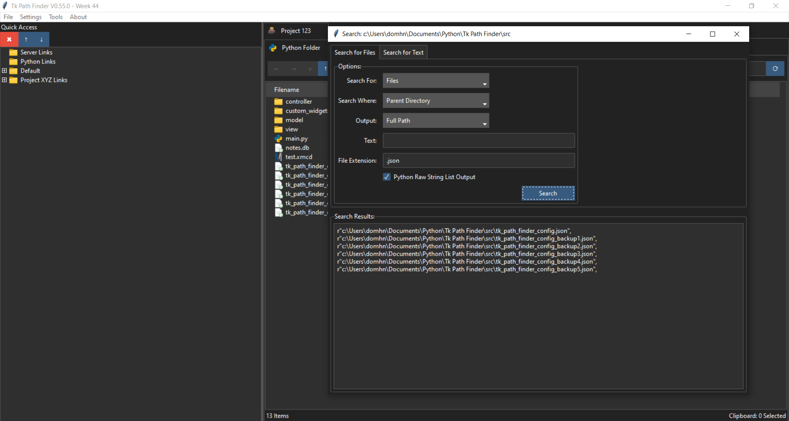

# Tk-Path-Finder 

## Description
A lightweight file explorer based on tabs within tabs written in python (Tkinter). 

It is intended to be a clean, simple interface that facilitates jumping back and forth between different folders on a given project. The tabs within tabs layout is intended to help with working on different projects. The app is focused primarily on text files and MS Office files. Images are not well handled and probably never will be. Finally, the quick access tree is setup so links can be grouped under a given folder, typically I create a folder for each project I am working on.

The app is largely complete and does what I set out to achieve. I am continuing to add minor improvements.

Comments, feedback and questions are welcome.

Icons taken from https://icons8.com/icons/set/gui

## Running the App
To run, download the code, unzip the files and run the main.py file. You will need several python libraries installed which are listed below.

Note the app creates 2 files, "tk_path_finder_config.json" and "notes.db" (sqlite database). These will be created in the default working directory. The json file stores all links and tabs created by the user. Several backups are automatically generated for this file. The database contains any notes entered into the diary.

## Features
  - Quick Access Sidebar, links can be grouped into individual folders.
  - Tabs within tabs layout.
  - Tabs can be reordered.
  - Load Last Session.
  - Search functionality.
  - Search for text with a given file extension.
  - Sort by date/file type
  - Filter by file extension.
  - Filter files containing string.
  - Rename files and folders.
  - Cut/Copy Files using the default windows dialog.
  - Create multiple folders at once (hit cntrl-d in the create folder window to duplicate line).
  - "Open with" functionality.
  - Open folder in explorer or command prompt.
  - Unzip .zip files
  - Compatible with MS Teams folders.
  - To Do List.
  - Diary.
  - PDF Tools
		- Extract Pages.
		- Merge PDFs.
  - Dark and Light themes.

## Limitations
  - Only tested on Windows 10.
  - No delete functionality. This is deliberate and not a feature I intend to add.
  - Search is very slow on sub-directories with many files.
  - Does not automatically refresh if any changes occur (outside of the app) in a directory. I may add this at some point but it is not a priority for me.

## Prerequisites

This project uses [uv](https://docs.astral.sh/uv/) for dependency management and virtual environments.

git clone https://github.com/domhnallmorr/Tk-Path-Finder.git

cd Tk-Path-Finder

uv sync

uv run python src/main.py

## Preview

